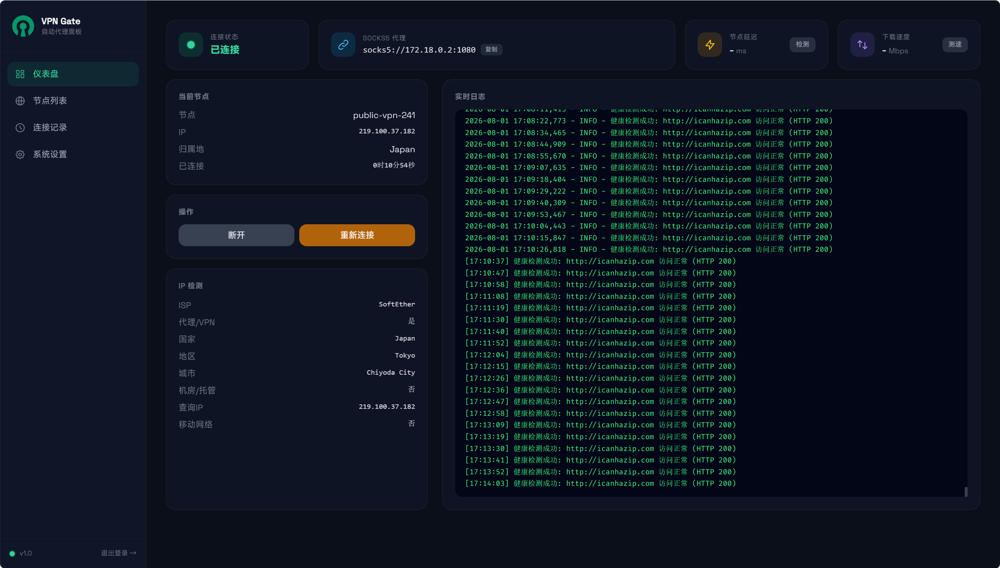

# VPN Gate 2 Proxy

[](https://github.com/zhaxg/vpngate2proxy/actions/workflows/docker-build.yml)
[](LICENSE)

一个基于 Docker 的自动化 VPN 代理网关。自动获取 [VPN Gate](https://www.vpngate.net/) 公共 VPN 节点，建立 OpenVPN 隧道，并通过 SOCKS5 代理对外提供服务。内置 Web 管理面板，支持节点自动切换、健康检测、优先节点等高级功能。

> **简而言之**：部署后，你只需在浏览器或应用中配置一个 SOCKS5 代理地址，即可自动通过全球公共 VPN 节点访问网络。节点故障时自动切换，无需人工干预。

---

## ✨ 核心功能

- **自动连接** — 启动后自动获取节点列表并建立 VPN 连接，连接失败时持续重试
- **SOCKS5 代理** — 对外提供标准 SOCKS5 代理，支持任意客户端
- **健康检测** — 定期通过代理访问检测 URL，连续失败自动切换节点（仅认 2xx 状态码）
- **优先节点** — 最多设置 3 个优先节点，优先连接，不可用时自动降级
- **Web 面板** — Tailwind CSS 暗色主题仪表盘，实时日志、节点列表、连接记录、设置管理
- **同子网优先** — 切换节点时优先选择同一子网，减少 IP 跳变
- **连接历史** — 记录每次连接的节点、时长，支持排序和分页
- **速度测试** — 通过代理测试下载速度
- **延迟检测** — 测试当前 VPN 隧道延迟
- **自动重连** — 断线后自动重连，连续失败清空黑名单重试所有节点
- **Docker 一键部署** — 开箱即用，支持 docker-compose

---

## 🚀 快速开始

### 前提条件

- 安装了 Docker 的 Linux 主机（推荐）或任何支持 Docker 的设备
- 默认需要端口：`8080`（Web 面板）、`1080`（SOCKS5 代理）

### 方式一：使用预构建镜像（推荐）

```bash
docker run -d --name vpn-proxy \
  --cap-add=NET_ADMIN --device=/dev/net/tun \
  -p 8080:8080 -p 1080:1080 \
  -v ./data:/data \
  ghcr.io/zhaxg/vpngate2proxy:latest
```

### 方式二：从源码构建

```bash
git clone https://github.com/zhaxg/vpngate2proxy.git
cd vpngate2proxy
docker build -t vpngate-proxy .
docker run -d --name vpn-proxy \
  --cap-add=NET_ADMIN --device=/dev/net/tun \
  -p 8080:8080 -p 1080:1080 \
  -v ./data:/data \
  vpngate-proxy
```

### 方式三：Docker Compose

创建 `docker-compose.yml`：

```yaml
services:
  vpn-proxy:
    image: ghcr.io/zhaxg/vpngate2proxy:latest
    container_name: vpn-proxy
    cap_add:
      - NET_ADMIN
    devices:
      - /dev/net/tun:/dev/net/tun
    ports:
      - "8080:8080"
      - "1080:1080"
    volumes:
      - ./data:/data
    restart: unless-stopped
```

然后执行：

```bash
docker compose up -d
```

### 首次使用

1. 访问 `http://<你的IP>:8080`，默认密码：`admin`
2. 进入「设置」页面，填入 VPN Gate API 地址（见下方说明）
3. 保存设置，系统自动开始获取节点并连接
4. 连接成功后，在你的应用中配置代理：`socks5://<你的IP>:1080`

---

## 🖥️ 界面预览

> 基于 Tailwind CSS 的暗色主题仪表盘，Space Grotesk 字体，玻璃拟态卡片设计。



---

## 📝 更新日志

### UI 重构 & Bug 修复 (2026-08-01)

**前端重写：**
- 从 Bootstrap 迁移到 Tailwind CSS 暗色主题
- 侧边栏导航 + 玻璃拟态卡片设计
- Space Grotesk 字体 + 自定义 SVG Logo/Favicon
- Toast 浮层通知替代模态框（延迟检测、测速）
- 状态感知按钮（连接/断开/重新连接根据状态切换）
- 节点列表新增 Score 评分列，千分位格式化
- 速率自动换算（bps → Kbps/Mbps/Gbps）
- 国旗 Emoji 自动匹配国家代码
- 延迟颜色编码（<200ms 绿 / <500ms 黄 / >500ms 红）
- 日志面板铺满视口高度，内部滚动
- 所有前端日志带时间戳 [HH:MM:SS]
- 下拉框自定义样式适配暗色主题
- 登录页同步暗色主题

**后端修复：**
- 健康检测只认 2xx HTTP 状态码（之前 503 误判为成功）
- 隧道预热改用可配置的健康检测地址（不再硬编码 httpbin.org）
- 延迟检测默认 ping 8.8.8.8（VPN 网关不响应 ICMP）
- SOCKS5 端口重用：添加 socket.shutdown() + 重试机制
- Flask 全局异常处理器返回 JSON（不再返回 HTML 错误页）
- 手动连接失败不再自动重试下一节点
- 节点延迟检测结果持久化缓存
- OpenVPN 支持 HTTP 代理连接（http-proxy 配置）
- res.json() 双重调用修复

**Docker 优化：**
- Tsinghua apt 镜像 + Aliyun pip 镜像（国内构建加速）

---

## ⚙️ 设置说明

所有设置在 Web 面板的「设置」页面中配置，保存后生效。

### 基础设置

| 设置项 | 默认值 | 生效方式 | 说明 |
|---|---|---|---|
| 面板密码 | `admin` | 即时 | Web 面板登录密码 |
| API 地址 | 空 | 即时 | VPN Gate 节点 API 地址 |
| VPN 用户名 | 空 | 即时 | OpenVPN 认证用户名（大多数节点不需要） |
| VPN 密码 | 空 | 即时 | OpenVPN 认证密码 |
| 默认连接地区 | `all` | 即时 | 筛选节点的国家/地区 |

### 网络设置

| 设置项 | 默认值 | 生效方式 | 说明 |
|---|---|---|---|
| SOCKS 端口 | `1080` | **重启** | SOCKS5 代理监听端口 |
| SOCKS 最大并发连接数 | `200` | **重启** | 同时代理连接数上限 |
| 面板端口 | `8080` | **重启** | Web 面板监听端口 |

### 节点管理

| 设置项 | 默认值 | 生效方式 | 说明 |
|---|---|---|---|
| 节点数据上限 | `200` | 即时 | 从 API 获取的最大节点数 |
| 检测数量上限 | `20` | 即时 | 后台预扫描的节点数 |
| 自动更新节点间隔 | `0`（关闭） | 即时 | 定时刷新节点列表（分钟） |
| 优先连接同 IP 段节点 | 关闭 | 即时 | 切换时优先选择同子网节点 |
| 子网前缀长度 | `24` | 即时 | 同子网判断范围（/24 = 前三段相同） |

### 健康检测

| 设置项 | 默认值 | 生效方式 | 说明 |
|---|---|---|---|
| 健康检测失败阈值 | `3` | 即时 | 连续失败多少次后切换节点 |
| 健康检测间隔 | `10` 秒 | 即时 | 每次检测的间隔时间 |
| 自定义健康检测地址 | 空 | 即时 | 自定义检测 URL（逗号或换行分隔） |
| 健康检测超时 | `8` 秒 | 即时 | 单次检测的最大等待时间 |
| 未连接时重连间隔 | `30` 秒 | 即时 | 断线后自动重连的等待时间 |

### 测试与日志

| 设置项 | 默认值 | 生效方式 | 说明 |
|---|---|---|---|
| 延迟检测地址 | 空（VPN 网关） | 即时 | ping 测试的目标地址 |
| 测速文件地址 | CacheFly 1MB | 即时 | 下载测速的文件 URL |
| 测速重试次数 | `3` | 即时 | 测速失败的重试次数 |
| 日志保存天数 | `3` | **重启** | 日志文件保留天数 |
| 连接记录保留天数 | `30` | 即时 | 超期记录自动清理 |

---

## 📁 项目结构

```
vpngate-proxy/
├── .github/workflows/
│   ├── docker-build.yml            # CI：推送 main 时自动构建镜像
│   └── docker-build-tag.yml        # CI：推送 tag 时构建发布镜像
├── app/
│   ├── app.py                      # Flask Web 服务 & REST API & WebSocket
│   ├── config.py                   # 配置读写，原子写入，敏感字段脱敏
│   ├── vpn_manager.py              # VPN 核心：节点获取、连接、健康检测、策略路由
│   ├── socks_server.py             # SOCKS5 代理服务器
│   └── templates/
│       ├── index.html              # Web 管理面板（单页应用）
│       └── login.html              # 登录页
├── images/                         # README 截图
├── Dockerfile                      # 容器构建文件
├── requirements.txt                # Python 依赖
└── README.md
```

---

## 🔧 技术架构

```
┌──────────────┐     HTTP/WS      ┌──────────────┐     subprocess     ┌──────────────┐
│   浏览器      │ ◄──────────────► │  Flask       │ ◄────────────────► │  OpenVPN      │
│   Web 面板    │                  │  SocketIO    │                    │  隧道进程      │
└──────────────┘                  └──────────────┘                    └──────────────┘
                                       │                                    │
                                       ▼                                    ▼
                                 ┌──────────────┐                    ┌──────────────┐
                                 │  VpnManager  │                    │  tun 接口     │
                                 │  核心引擎     │                    │  策略路由     │
                                 └──────────────┘                    └──────────────┘
                                       │                                    │
                                       ▼                                    ▼
                                 ┌──────────────┐                    ┌──────────────┐
                                 │  JSON 文件    │                    │  SOCKS5 代理  │
                                 │  配置 + 历史  │                    │  出口绑定 VPN │
                                 └──────────────┘                    └──────────────┘
                                                                          │
                                                                          ▼
                                                                   ┌──────────────┐
                                                                   │   外部网络    │
                                                                   │  通过 VPN 出口│
                                                                   └──────────────┘
```

### 策略路由原理

```
默认路由 (table main):
  default via 192.168.1.1 dev eth0
  → 容器管理流量走这条（API 请求、健康检测）

策略路由 (table 100):
  ip rule: from 10.8.0.2 table 100
  ip route: default via 10.8.0.1 dev tun0 table 100
  → SOCKS5 代理流量走 VPN 隧道
```

SOCKS5 代理的出口绑定到 VPN 隧道 IP，流量自动匹配策略路由，确保代理流量走 VPN，管理流量走直连。

---

## 📡 API 接口

所有接口需要登录认证（Session Cookie）。

| 方法 | 路径 | 说明 |
|---|---|---|
| GET/POST | `/login` | 登录 |
| GET | `/logout` | 退出 |
| GET | `/api/status` | 当前连接状态 |
| GET | `/api/nodes?region=XX` | 节点列表（支持地区筛选） |
| POST | `/api/connect` | 连接指定节点 `{ip}` |
| POST | `/api/disconnect` | 断开连接 |
| POST | `/api/auto_connect` | 自动连接 |
| GET/POST | `/api/config` | 读取/保存配置 |
| POST | `/api/restart` | 重启服务 |
| GET | `/api/latency` | 延迟检测 |
| POST | `/api/nodes_latency` | 批量延迟检测 `{ips: [...]}` |
| GET | `/api/speedtest` | 下载速度测试 |
| GET | `/api/logs` | 最近日志（最多 1000 行） |
| GET | `/api/system` | 系统信息 |
| GET | `/api/connection_history` | 连接历史（支持分页排序） |
| DELETE | `/api/connection_history/<id>` | 删除历史记录 |
| GET/POST | `/api/preferred_nodes` | 管理优先节点 |

---

## 🛡️ 安全说明

- Web 面板密码哈希比较（注意：当前为明文存储，建议在反向代理后使用）
- REST API 和 WebSocket 均需登录认证
- 配置文件原子写入，防止损坏
- 连接历史文件原子写入
- 敏感配置（密码、密钥）API 返回时脱敏

---

## 🌐 API 地址获取

VPN Gate 的 API 地址：`https://www.vpngate.net/api/iphone/`

如果该地址被屏蔽，可以使用 Cloudflare Workers 做中转。在 Cloudflare Workers 中部署以下代码：

```javascript
export default {
  async fetch(request, env, ctx) {
    const TARGET_URL = "http://www.vpngate.net/api/iphone";

    const headers = {
      "User-Agent": "Mozilla/5.0 (iPhone; CPU iPhone OS 16_5 like Mac OS X) AppleWebKit/605.1.15",
      "Accept": "text/html,application/xhtml+xml,application/xml;q=0.9,*/*;q=0.8"
    };

    try {
      const response = await fetch(TARGET_URL, { headers, timeout: 8000 });

      if (!response.ok) {
        return new Response(`抓取失败，状态码: ${response.status}`, { status: 502 });
      }

      const rawText = await response.text();

      if (!rawText.includes("#HostName") || !rawText.includes("OpenVPN_ConfigData_Base64")) {
        return new Response("数据格式异常", { status: 502 });
      }

      return new Response(rawText, {
        status: 200,
        headers: {
          "Content-Type": "text/plain; charset=utf-8",
          "Access-Control-Allow-Origin": "*",
          "Cache-Control": "no-cache, no-store, must-revalidate"
        }
      });
    } catch (error) {
      return new Response(`中转错误: ${error.message}`, { status: 500 });
    }
  }
};
```

部署后将 Workers 的 URL 填入设置中的「API 地址」即可。

---

## ❓ 常见问题

### 连接节点不在节点列表中？

正常现象。VPN Gate 每次 API 返回约 100 个节点，但节点总量远超此数。只要当前节点通过健康检测，即可正常使用。

### 提示"所有节点均连接失败"？

1. 检查 API 地址是否正确且可访问
2. 检查容器是否有网络连接
3. 尝试切换地区（如从 `all` 切换到 `JP`、`US` 等）
4. 等待几分钟后重试（节点列表会自动刷新）

### 如何查看实时日志？

访问 Web 面板 → 仪表盘 → 右侧实时日志面板，或查看容器日志：

```bash
docker logs -f vpn-proxy
```

### 如何更新到最新版本？

```bash
docker pull ghcr.io/xiaowen-king/vpngate-proxy:latest
docker stop vpn-proxy && docker rm vpn-proxy
# 重新执行 docker run 命令
```

使用 docker-compose 时：

```bash
docker compose pull
docker compose up -d
```

---

## 📄 开源协议

本项目基于 [MIT License](LICENSE) 开源。

---

## 致谢

- **[xiaowen-king](https://github.com/xiaowen-king)** — 项目原作者，提供了完整的 VPN 代理网关核心架构
- [VPN Gate](https://www.vpngate.net/) — 提供公共 VPN 节点服务
- [OpenVPN](https://openvpn.net/) — VPN 隧道
- [Flask](https://flask.palletsprojects.com/) — Web 框架
- [Tailwind CSS](https://tailwindcss.com/) — 前端 UI 框架
- [Space Grotesk](https://fonts.google.com/specimen/Space+Grotesk) — 字体
